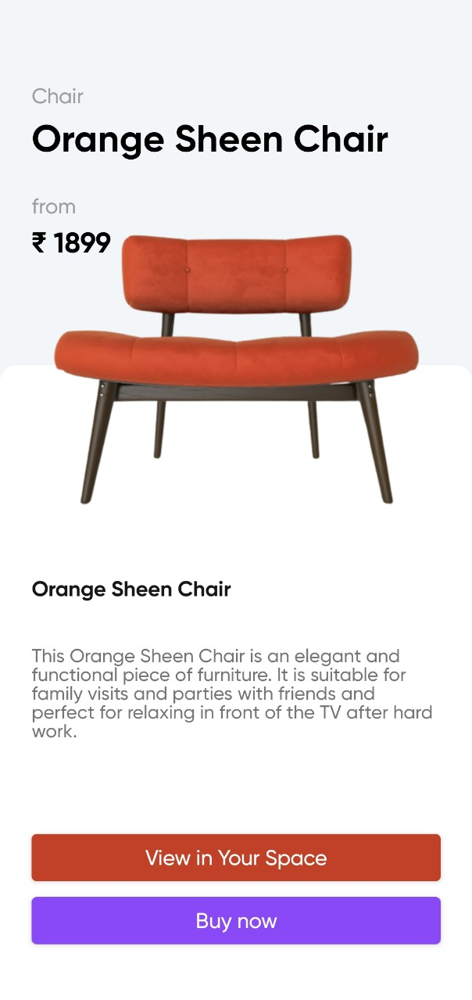
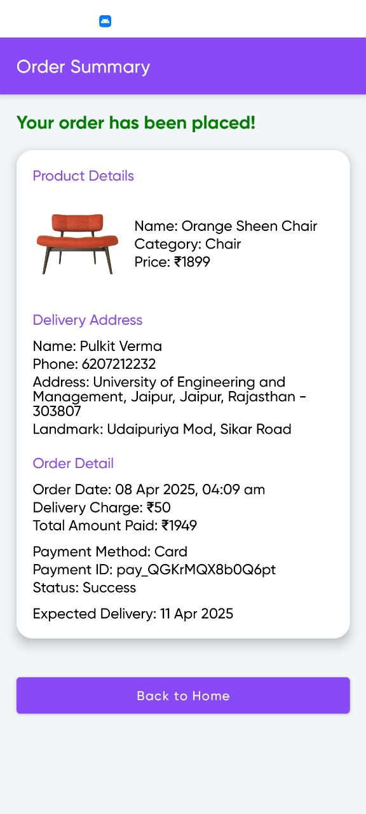

# 🛋️ Luxture App - AR-Based Furniture Shopping Experience

Luxture is an Augmented Reality (AR)-powered mobile application that transforms how users shop for furniture online. Built using **Kotlin** and **Jetpack Compose**, it provides a real-time, immersive shopping experience by allowing users to visualize 3D models of furniture in their own space before purchasing.

---

## 🧩 Problem Statement

With the rise of online shopping, a significant number of product returns occur due to:

* Incorrect size
* Mismatched color or design
* Poor visualization of the product

These returns cause **financial losses to sellers** and **frustration for customers**.

---

## ✅ Our Solution

**Luxture App** addresses this issue by allowing users to **view 3D models of furniture in their real environment using AR**. This helps ensure the selected product fits well in their space, matches their interior design, and meets their expectations.

By providing a “try-before-you-buy” experience, we significantly reduce product returns and enhance customer satisfaction.

---

## 📲 Download App for Trial

You can try out the Luxture App on your Android device:

)

> ⚠️ Make sure your device supports ARCore for the best experience.

---

## 📸 Screenshots & Demo Video

---

## 🛠️ Technology Used

* **Programming Language**: Kotlin
* **UI Framework**: Jetpack Compose
* **AR Integration**: Android ARCore
* **Database & Backend**: Firebase (Firestore, Authentication, Storage)
* **Payment Gateway**: Razorpay
* **Authentication**:

  * Email & Password
  * Google Sign-In

---

## 🌟 Key Features

### 🔍 AR Furniture Preview

* View realistic 3D models of furniture in your room using your smartphone camera.
* Adjust and rotate models to see from all angles.

### 👤 User Authentication

* Register and login using **Email/Password** or **Google Sign-In**.
* Firebase Authentication ensures secure login management.

### 🛒 Smooth Shopping Experience

* Browse furniture listings uploaded by sellers.
* Add your **address** for delivery.
* Perform **secure payments** using **Razorpay**.

### 💳 Payment and Order

* Razorpay integration for fast and secure payment.
* Order confirmation screen with full **order summary** and **delivery details**.

### ☁️ Firebase Integration

* **3D Model Storage**: Upload and retrieve 3D models via Firebase Storage.
* **User Data Management**: Store user profiles, addresses, and order history using Firestore.

---

## 📊 Tech Stack & Tools

| Tech/Tool              | Usage               | Benefit                           |
| ---------------------- | ------------------- | --------------------------------- |
| **Kotlin**             | Main language       | Modern, safe, concise             |
| **Jetpack Compose**    | UI Framework        | Declarative, less boilerplate     |
| **ARCore**             | AR support          | Real-world 3D model placement     |
| **Firebase Firestore** | Database            | Scalable, real-time data          |
| **Firebase Auth**      | Login/Register      | Secure auth & session             |
| **Firebase Storage**   | Model storage       | Stores 3D assets                  |
| **Razorpay SDK**       | Payments            | Trusted payment system            |
| **Hilt**               | DI                  | Clean architecture, testable code |
| **Retrofit/OkHttp**    | Networking          | API integration                   |
| **Coil**               | Image loading       | Fast, Compose-optimized           |
| **Accompanist**        | WebView, Animations | Enhances Compose UI               |
| **Navigation Compose** | Screen routing      | Simplified navigation             |

---

## 🚀 How It Helps

1. **Reduces product returns** by giving a real-world view of furniture.
2. **Saves time and cost** for both customers and sellers.
3. **Enhances trust** in online shopping for big-ticket items like furniture.
4. **Improves buyer decision-making** with interactive 3D previews.

---

## 📱 Future Enhancements

* Wishlist and product reviews
* Augmented Reality improvements (e.g., lighting, shadows)
* Seller dashboard for inventory management
* Order tracking and delivery status updates

---

## 👨‍💻 Developer Note

> Luxture was designed with a strong focus on solving a real problem in online shopping. This app empowers users to **make informed buying decisions** and **helps sellers reduce losses due to unnecessary returns**.

---

## 🔐 License

This project is licensed under the MIT License - feel free to use and contribute.
